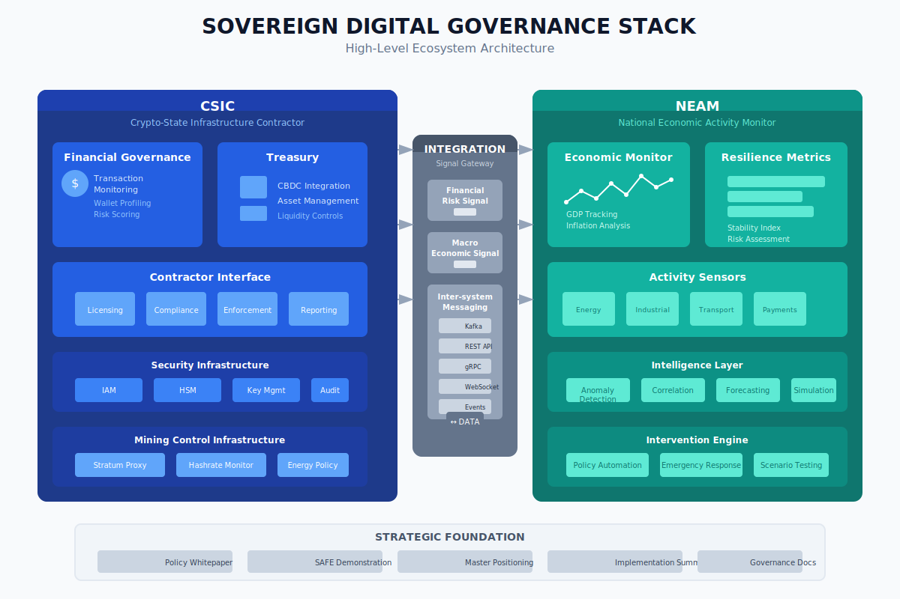

# Sovereign Digital Governance Stack (SDGS)

<p align="center">
  
</p>

## Overview

The Sovereign Digital Governance Stack (SDGS) is a comprehensive framework for state-grade digital infrastructure, combining two independent but aligned platforms:

- **CSIC** (Crypto-State-Infrastructure-Contractor): Digital money control, financial surveillance, crypto/CBDC oversight
- **NEAM** (National Economic Activity Monitor): Economic sensing, payments monitoring, industrial output analysis

SDGS is **not a monolithic application**. It is a **governance + orchestration layer** that provides the constitutional framework for both platforms to operate in alignment under sovereign control.

> **View Visualizations**: The SDGS repository includes three comprehensive SVG diagrams:
> - [Ecosystem Map](sdgs-ecosystem-map.svg) - High-level architecture
> - [Signal Flow Logic](signal-flow-logic.svg) - Data flow and processing
> - [Governance Stack Pyramid](governance-stack-pyramid.svg) - Layered architecture
>
> 💡 **Tip**: Download SVG files and open in a browser for full interactivity, or view the raw code for embedding in documents.

## Architecture Visualizations

### High-Level Ecosystem Map

<p align="center">
  <a href="sdgs-ecosystem-map.svg" target="_blank">
    
  </a>
</p>

This diagram illustrates the complete Sovereign Digital Governance Stack:

- **Left Pillar (CSIC)**: Deep blue container displaying the Crypto-State Infrastructure Contractor with Financial Governance, Treasury Systems, Contractor Interface modules, Security Infrastructure, and Mining Control Infrastructure
- **Center Bridge (Integration Layer)**: Slate-colored signal gateway with Financial Risk Signal, Macro Economic Signal, and Inter-system Messaging protocols (Kafka, REST API, gRPC, WebSocket)
- **Right Pillar (NEAM)**: Teal container displaying the National Economic Activity Monitor with Economic Monitor, Resilience Metrics, Activity Sensors (Energy, Industrial, Transport, Payments), Intelligence Layer, and Intervention Engine
- **Foundation**: Strategic documents base showing Policy Whitepaper, SAFE Demonstration, Master Positioning, Implementation Summary, and Governance Documentation

### Signal Flow Logic

<p align="center">
  <a href="signal-flow-logic.svg" target="_blank">
    
  </a>
</p>

This flowchart illustrates how economic signals trigger governance actions across the integrated stack:

1. **NEAM Sensor Input** (Green): Detects economic events
2. **Data Classification & Verification** (Blue): Processing and normalization
3. **Signal Contract Trigger** (Amber): Threshold checking and risk evaluation
4. **Decision Point**: YES/NO branching for policy triggers
5. **CSIC Governance Action** (Navy): Allocation/restriction for approved triggers
6. **Continue Monitoring** (Grey): Loop back for non-triggering events
7. **Audit Log Entry**: Immutable record-keeping for all actions

### Governance Stack Pyramid

<p align="center">
  <a href="governance-stack-pyramid.svg" target="_blank">
    
  </a>
</p>

This layered architecture diagram presents the hierarchical stack from infrastructure to application:

**Level 1 (Top - Indigo) - Application Layer:**
- CSIC Applications: Regulator Dashboard, Admin Console, Compliance Portal, Licensing System
- NEAM Applications: National Dashboard, Crisis Console, Intelligence Reports, Intervention Panel
- Shared Services & APIs: REST API, GraphQL, gRPC, WebSocket, Auth

**Level 2 (Cyan) - Protocol & Logic Layer:**
- Smart Contracts (VASP Licensing)
- Governance Rules (Policy Engine, Decision Engine)
- Signal Processing (Risk Evaluation)

**Level 3 (Slate) - Security & Data Layer:**
- Data Classification, Audit Framework, Encryption, Access Control

**Level 4 (Base - Dark Navy) - Sovereign Infrastructure:**
- Kubernetes Clusters, Database Servers, Network Infrastructure, HSM Hardware

## Architecture Principles

1. **Independent Operation**: Each platform maintains its own lifecycle, deployment, and operational procedures
2. **Loose Coupling**: Systems communicate through well-defined signals and events, not shared databases
3. **Data Sovereignty**: All data remains under sovereign control with clear classification boundaries
4. **Auditability**: Complete traceability of all operations and inter-system communications

## Directory Structure

```
SDGS/
├── csic/                          # Crypto-State-Infrastructure-Contractor
│   ├── blockchain/                # Blockchain indexer, nodes, and parser
│   ├── compliance/                # Compliance and licensing services
│   ├── frontend/                  # Admin and regulator dashboards
│   ├── security/                  # IAM, HSM, and key management
│   ├── services/                  # API gateway, audit, control-layer
│   └── extended-service/          # CBDC, defense telemetry, financial crime unit
│
├── neam/                          # NEAM Platform
│   ├── sensing/                   # Energy, industrial, transport adapters
│   ├── intelligence/              # Anomaly detection and correlation
│   ├── intervention/              # Emergency and policy interventions
│   ├── macro/                     # GDP and inflation monitoring
│   ├── reporting/                 # Real-time and statutory reporting
│   └── frontend/                  # National dashboard
│
├── integration/                   # Signal gateway contracts
│   └── signal-gateway/
│       ├── contracts/
│           ├── financial-risk.signal.json
│           └── macro-economic.signal.json
│
├── docs/                          # Strategic governance documentation
│   ├── Policy-Whitepaper.md
│   ├── SAFE-Demonstration.md
│   ├── Sovereign-Digital-Governance-Stack.md
│   ├── Strategic-Implementation-Summary.md
│   ├── governance-model.md
│   ├── security-architecture.md
│   ├── data-classification.md
│   ├── audit-framework.md
│   └── compliance-mapping.md
│
├── infra/                         # Kubernetes / Terraform / Helm
│   ├── kubernetes/
│   ├── terraform/
│   └── helm/
│
├── shared/                        # Shared schemas & standards
│   ├── schemas/
│   └── standards/
│
├── sdgs-ecosystem-map.svg         # High-level architecture diagram
├── signal-flow-logic.svg          # Signal flow workflow diagram
├── governance-stack-pyramid.svg   # Layered architecture diagram
└── README.md
```

## Documentation

Comprehensive documentation is available in the [docs](docs/) directory:

### Strategic Documentation
- [SDGS Overview](docs/sdgs-overview.md) - Master positioning document
- [Policy Whitepaper](docs/Policy-Whitepaper.md) - Academic/policy framework
- [SAFE Demonstration](docs/SAFE-Demonstration.md) - Simulation scenario
- [Strategic Implementation Summary](docs/Strategic-Implementation-Summary.md) - Roadmap and commercial strategy

### Governance Framework
- [Governance Model](docs/governance-model.md) - Constitutional framework
- [Security Architecture](docs/security-architecture.md) - Security design principles
- [Data Classification](docs/data-classification.md) - Data handling standards
- [Audit Framework](docs/audit-framework.md) - Audit and compliance requirements
- [Compliance Mapping](docs/compliance-mapping.md) - Regulatory alignment
- [Inter-System Signals](docs/inter-system-signals.md) - Signal contract specifications

## Integration

SDGS defines signal contracts for inter-system communication:

### Signal Contracts

| Signal Type | Direction | Description |
|-------------|-----------|-------------|
| **Financial Risk Signal** | CSIC → NEAM | Risk indicators, compliance flags |
| **Macro-Economic Signal** | NEAM → CSIC | Activity indices, sector health |
| **Policy Signal** | Bidirectional | Regulatory updates, intervention requests |

### Inter-system Messaging

- **Kafka**: Event streaming and real-time messaging
- **REST API**: Synchronous communication endpoints
- **gRPC**: High-performance service-to-service calls
- **WebSocket**: Real-time data feeds and alerts

See [Inter-System Signals](docs/inter-system-signals.md) for detailed specifications.

## Infrastructure

### Development/Testing Environment
- Separate docker-compose stacks per platform
- Isolated Kafka topics per platform
- Independent databases per platform
- Local Kubernetes clusters for integration testing

### Sovereign/Production Environment
- Kubernetes namespaces per system (csic, neam, shared)
- Shared services:
  - IAM (Identity and Access Management)
  - HSM/Vault (Key Management)
  - Centralized Audit Logging
- Air-gapped capable deployments
- Zero-trust network architecture

## Compliance Standards

The SDGS is designed to meet the following compliance requirements:

- **GDPR Ready**: Privacy-by-design architecture
- **ISO 27001**: Information security management
- **SOC 2**: Service organization controls
- **FinTech Standards**: Financial services regulations
- **National Resilience Framework**: Critical infrastructure protection

## Quick Start

### Prerequisites

- Git 2.30+
- Docker 20.10+
- Kubernetes cluster (kubectl configured)
- Helm 3.0+
- Go 1.20+ (for CSIC services)
- Node.js 18+ (for frontend components)

### Development Setup

```bash
# Clone the SDGS workspace
git clone https://github.com/jitenkr2030/Sovereign-Digital-Governance-Stack.git SDGS
cd SDGS

# Initialize submodules (if any)
git submodule update --init --recursive

# Verify installation
ls -la *.svg  # Check visualizations are present
```

### Platform-Specific Development

**CSIC Development:**
```bash
cd SDGS/csic
git checkout -b feature/<feature-name>
# develop your feature
git add .
git commit -m "Add feature description"
git push origin feature/<feature-name>
```

**NEAM Development:**
```bash
cd SDGS/neam
git checkout -b feature/<feature-name>
# develop your feature
git add .
git commit -m "Add feature description"
git push origin feature/<feature-name>
```

## Contributing

1. Work within the appropriate platform directory (csic or neam)
2. Follow platform-specific contribution guidelines
3. Update SDGS documentation if changes affect governance
4. Submit PRs through standard review process
5. Ensure visualizations are updated for architectural changes

## Security

This is **state-grade digital infrastructure**. All contributions must:

- Maintain security boundaries between platforms
- Follow data classification requirements (Public / Internal / Confidential / Restricted)
- Ensure complete audit trail coverage
- Support sovereign deployment requirements
- Pass security review before merge

## License

All components of SDGS are proprietary state infrastructure. See individual platform licenses for details:

- [CSIC License](csic/LICENSE.md)
- [NEAM License](neam/LICENSE)

---

<p align="center">
  
</p>

<p align="center">
  <strong>Sovereign Digital Governance Stack</strong><br>
  National Resilience Infrastructure
</p>
