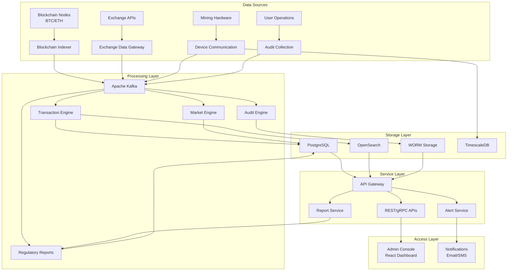

# Crypto State Infrastructure Contractor (CSIC) Platform

[](LICENSE)
[](https://golang.org/)
[](https://reactjs.org/)
[](docs/)

A sovereign-grade infrastructure solution enabling governments to legally regulate, monitor, and control cryptocurrency ecosystems with full security and auditability.

## Quick Links

| Resource | Description |
|----------|-------------|
| [📖 QUICK_START](QUICK_START.md) | Get started with the platform in 5 minutes |
| [🏗️ System Overview](docs/system-overview.md) | Complete system architecture and capabilities |
| [📊 Data Flow Diagrams](docs/data-flow-diagrams.md) | Detailed data flow documentation |
| [📋 API Reference](docs/api-reference.md) | Complete API documentation |
| [🛡️ Security Guide](docs/security-guide.md) | Security best practices and considerations |

## Platform Architecture



## Core Capabilities

### Blockchain Monitoring
Real-time indexing and analysis of blockchain networks including Bitcoin and Ethereum, with comprehensive transaction tracking and risk assessment capabilities.

### Exchange Surveillance
Continuous monitoring of cryptocurrency exchange activities to detect market manipulation, wash trading, and other abusive practices that undermine market integrity.

### Mining Operations Control
Registry and monitoring of all licensed mining operations with energy consumption tracking, hash rate validation, and remote enforcement capabilities.

### Compliance Management
Automated compliance verification against regulatory requirements including FATF guidelines, with configurable rule engines supporting jurisdiction-specific requirements.

### Wallet Governance
Multi-signature wallet management with asset freezing capabilities, recovery mechanisms, and integration with hardware security modules for key protection.

### Audit and Evidence
Immutable audit trails with cryptographic integrity protection, supporting legal proceedings and regulatory investigations with tamper-evident logging.

## System Requirements

| Component | Minimum | Recommended |
|-----------|---------|-------------|
| CPU | 8 cores | 32 cores |
| Memory | 32 GB | 128 GB |
| Storage | 500 GB SSD | 2 TB NVMe |
| Network | 1 Gbps | 10 Gbps |

### Software Prerequisites

- **Operating System**: CentOS 8 / Rocky Linux 8 / Ubuntu 22.04 LTS
- **Runtime**: Go 1.21+, Node.js 18+, Docker 24+
- **Database**: PostgreSQL 16 with TimescaleDB
- **Message Queue**: Apache Kafka 3.x
- **Container Orchestration**: Kubernetes 1.28+ or Docker Compose

## Deployment Options

### Local Development
```bash
docker-compose up -d
```

### On-Premise Deployment
Complete offline deployment with all data remaining within organizational boundaries.

### Private Cloud
Kubernetes-based deployment with full container orchestration support.

### Hybrid Mode
Core components deployed on-premise with cloud-assisted analytics capabilities.

## Documentation Structure

```
csic-platform/
├── README.md                 # This file - project hub
├── QUICK_START.md           # 5-minute getting started guide
├── docs/
│   ├── system-overview.md   # Complete system documentation
│   ├── data-flow-diagrams.md # Data flow architecture
│   ├── api-reference.md     # API documentation
│   └── security-guide.md    # Security considerations
├── frontend/
│   └── dashboard/           # React-based admin console
├── services/
│   ├── api-gateway/         # Central API gateway
│   ├── blockchain/          # Blockchain services
│   ├── compliance/          # Compliance module
│   ├── control-layer/       # Policy enforcement
│   ├── exchange/            # Exchange surveillance
│   ├── health-monitor/      # System health
│   ├── mining/              # Mining control
│   └── reporting/           # Regulatory reports
└── infrastructure/
    └── docker/              # Docker configurations
```

## Key Design Principles

**Data Sovereignty**
All data remains within national borders with no reliance on foreign cloud services, ensuring complete control over sensitive financial information.

**Deterministic Compliance**
Regulatory rules encoded in executable code rather than natural language documentation, eliminating ambiguity in compliance interpretation.

**Immutable Auditability**
All actions, transactions, and decisions recorded in tamper-proof logs supporting forensic investigation and legal proceedings.

**Extensibility**
Modular architecture enables adaptation to diverse regulatory domains beyond cryptocurrency, including CBDC monitoring and financial crime compliance.

## Compliance Standards

The platform implements controls aligned with international standards:

- ISO 27001 Information Security Management
- GDPR Data Protection Requirements
- Basel III Financial Regulations
- FATF Virtual Asset Service Provider Guidelines

## Support and Contact

- **Technical Support**: support@csic.gov
- **Security Issues**: security@csic.gov
- **Compliance Questions**: compliance@csic.gov

## License

The CSIC Platform operates under licensing arrangements specific to national implementation requirements. Contact the development team for licensing inquiries.

---

**Note**: This is a sovereign-grade platform designed for government deployment. All deployments should be conducted in consultation with appropriate security and compliance authorities.
