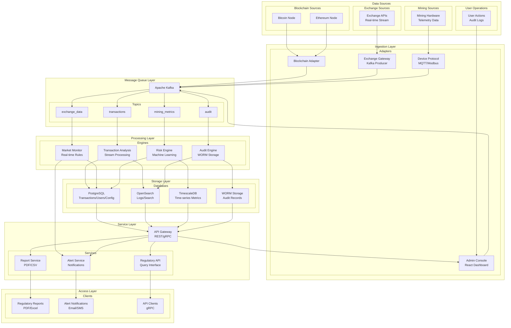
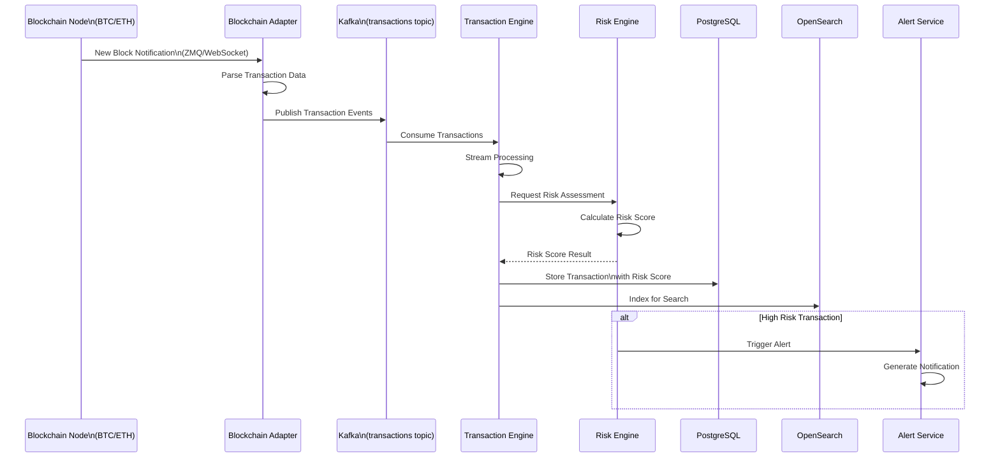
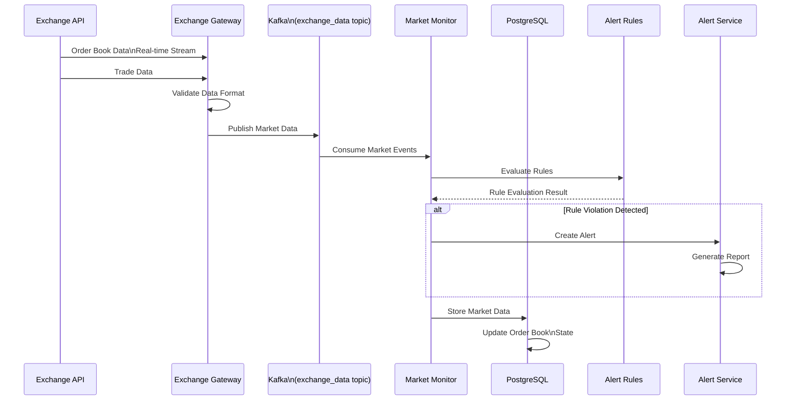
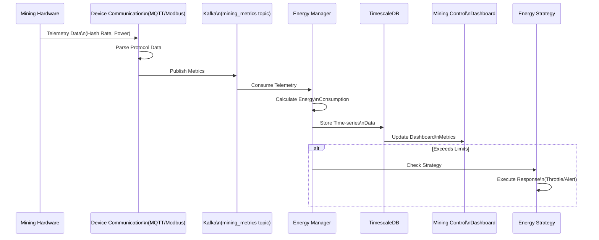
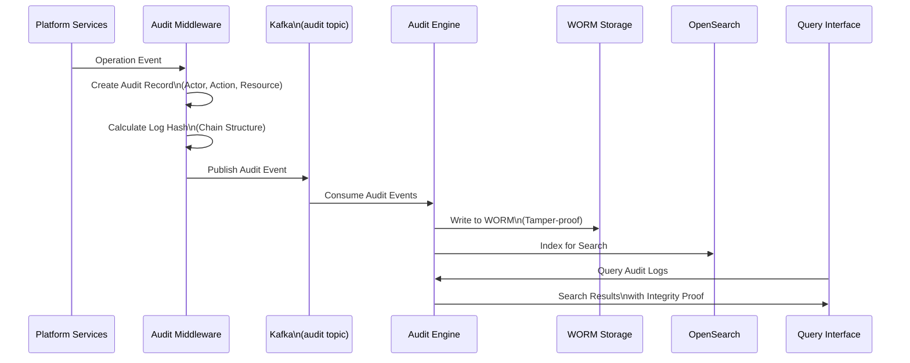
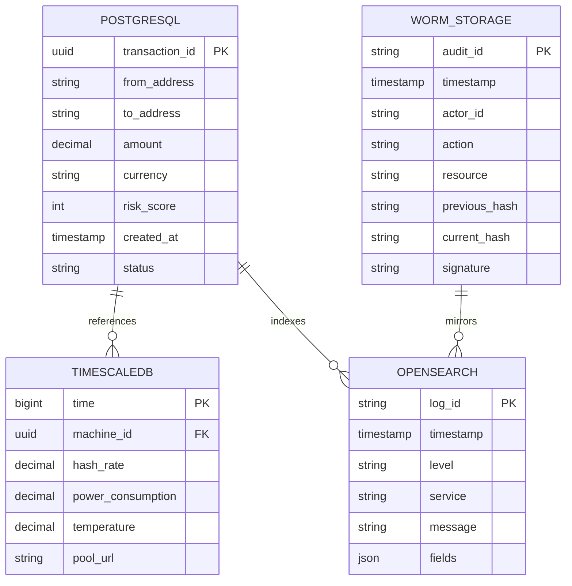
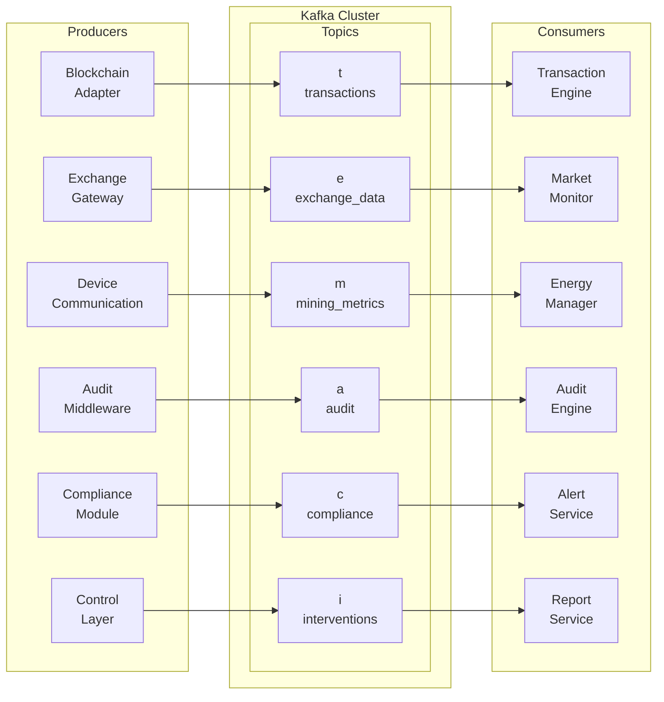
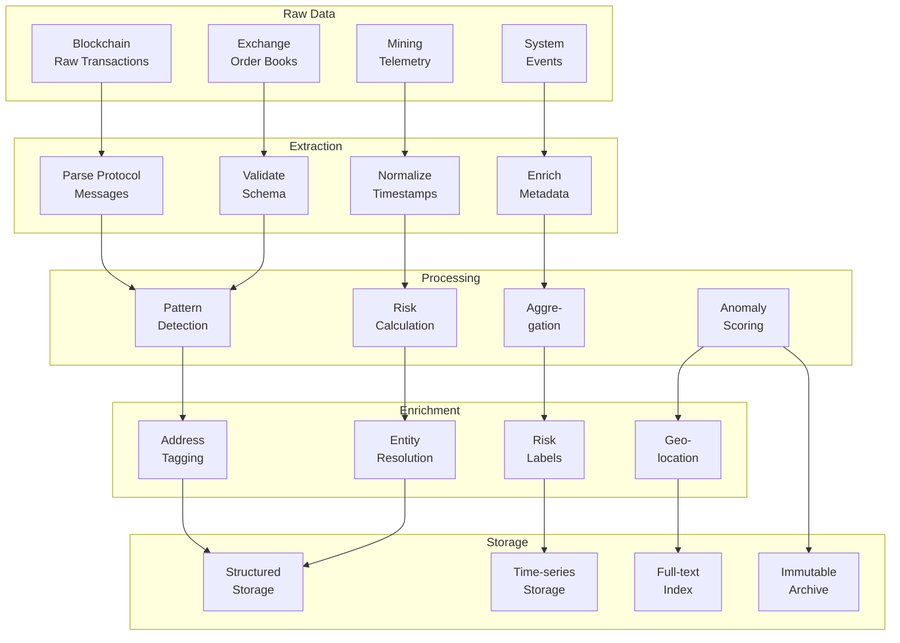

# Data Flow Architecture

This document describes the complete data flow architecture for the CSIC Platform, covering data ingestion, processing, storage, and presentation layers.

## Architecture Overview

## Data Flow Details

### Blockchain Transaction Data Flow

### Exchange Monitoring Data Flow

### Mining Telemetry Data Flow

### Audit Log Data Flow

## Storage Architecture

## Data Retention Policy

| Data Type | Storage Location | Retention Period | Archival Strategy |
|-----------|-----------------|------------------|-------------------|
| Transaction Records | PostgreSQL | 7 years | Archive to cold storage |
| Audit Logs | WORM Storage | 7 years | Permanent retention |
| Monitoring Metrics | TimescaleDB | 90 days | Aggregate, retain 7 years |
| System Logs | OpenSearch | 365 days | Archive to object storage |
| Alert Records | PostgreSQL | 7 years | Archive to cold storage |
| Reports | Object Storage | 7 years | Compressed archive |

## Performance Requirements

| Metric | Target | Maximum |
|--------|--------|---------|
| Transaction Processing | 10,000 TPS | 50,000 TPS |
| Exchange Data Latency | < 1 second | < 5 seconds |
| Blockchain Sync Latency | < 30 seconds | < 2 minutes |
| API Response Time | < 100ms | < 500ms |
| Alert Notification Delay | < 5 seconds | < 30 seconds |
| Query Response (Complex) | < 2 seconds | < 10 seconds |

## Message Queue Topics

## Data Transformation Pipeline

## Quality Assurance

### Data Validation Rules

- Schema validation on all incoming messages
- Checksum verification for blockchain data
- Timestamp synchronization across sources
- Duplicate detection and handling
- Missing data interpolation

### Monitoring Metrics

- Message throughput per topic
- Processing latency per stage
- Error rates by data source
- Storage growth rates
- Query performance metrics
