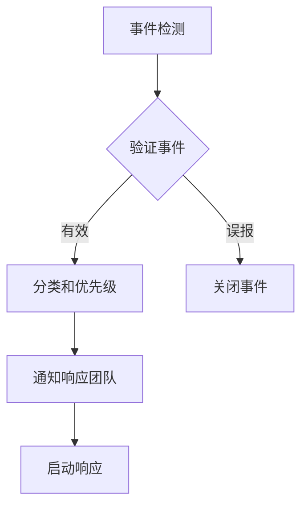

# 事件响应计划

## 概述

本文档定义了CSIC平台的安全事件响应流程，包括事件分类、响应流程和沟通策略。

## 事件分类

### 事件级别

| 级别 | 描述 | 示例 | 响应时间 |
|------|------|------|----------|
| P1 - 紧急 | 系统不可用或严重安全漏洞 | 数据泄露、核心服务崩溃 | 15分钟 |
| P2 - 高 | 重要功能受损 | 单个服务故障、部分数据丢失 | 1小时 |
| P3 - 中 | 一般性问题 | 性能下降、告警误报 | 4小时 |
| P4 - 低 | 信息性事件 | 日志异常、配置提示 | 24小时 |

### 事件类型

| 类型 | 描述 | 影响范围 |
|------|------|----------|
| 安全事件 | 未经授权的访问尝试 | 数据、系统 |
| 可用性事件 | 服务中断或降级 | 服务、用户 |
| 完整性事件 | 数据被篡改 | 数据、配置 |
| 性能事件 | 响应时间超标 | 服务、用户 |
| 合规事件 | 审计失败 | 合规、报告 |

## 响应团队

### 安全运营中心 (SOC)

- **安全分析师**: 事件检测和分析
- **安全工程师**: 应急响应和技术支持
- **事件响应经理**: 协调和沟通

### 技术支持团队

- **系统管理员**: 系统恢复
- **数据库管理员**: 数据库恢复
- **网络工程师**: 网络恢复

### 管理团队

- **IT主管**: 资源调配
- **合规官**: 合规报告
- **公关经理**: 对外沟通

## 响应流程

### 1. 检测阶段



**检测方法**:
- 自动化监控告警
- SIEM关联分析
- 用户报告
- 第三方通报

### 2. 分析阶段

**分析任务**:
- 确定攻击向量
- 评估影响范围
- 识别受影响的系统
- 收集证据

**证据收集**:
- 系统日志
- 网络流量
- 内存转储
- 磁盘镜像

### 3. 遏制阶段

**即时遏制**:
- 隔离受影响的系统
- 阻断攻击源
- 禁用受损账户
- 启用备用系统

**长期遏制**:
- 部署安全补丁
- 增加监控
- 调整访问控制
- 修复漏洞

### 4. 根除阶段

**根除措施**:
- 删除恶意软件
- 修复配置错误
- 更新安全策略
- 重置凭据

### 5. 恢复阶段

**恢复步骤**:
- 从备份恢复
- 验证系统完整性
- 逐步恢复服务
- 监控恢复状态

### 6. 事后阶段

**事后活动**:
- 编写事件报告
- 更新安全策略
- 改进检测规则
- 进行复盘

## 沟通计划

### 内部沟通

| 阶段 | 接收者 | 内容 | 方式 |
|------|--------|------|------|
| 检测 | SOC团队 | 初步告警 | 邮件、短信 |
| 确认 | IT主管 | 事件详情 | 会议 |
| 响应 | 所有相关人员 | 状态更新 | 即时通讯 |
| 恢复 | 管理层 | 恢复报告 | 邮件 |

### 外部沟通

| 阶段 | 接收者 | 内容 | 方式 |
|------|--------|------|------|
| 法律要求 | 监管机构 | 合规报告 | 正式报告 |
| 法律要求 | 执法部门 | 证据提供 | 正式渠道 |
| 影响客户 | 受影响用户 | 通知公告 | 邮件、公告 |
| 公众 | 媒体 | 新闻稿 | 新闻发布 |

## 恢复程序

### 数据恢复

```bash
# 恢复数据库
./scripts/restore/restore-db.sh --timestamp <backup_time> --target <target_server>

# 恢复配置文件
./scripts/restore/restore-config.sh --config <config_file>

# 恢复审计日志
./scripts/restore/restore-audit.sh --backup <backup_path>
```

### 系统恢复

```bash
# 检查系统健康
./scripts/monitoring/health-check.sh --full

# 恢复服务
./scripts/deploy/restore-services.sh --services <service_list>

# 验证系统状态
./scripts/monitoring/verify-system.sh
```

## 事后报告模板

### 事件摘要

- 事件ID
- 检测时间
- 解决时间
- 影响范围
- 根本原因

### 时间线

| 时间 | 事件 | 操作者 |
|------|------|--------|
| | | |

### 影响评估

- 受影响系统
- 受影响数据
- 业务影响
- 合规影响

### 响应评估

- 检测有效性
- 响应时间
- 遏制效果
- 沟通效果

### 改进建议

- 短期措施
- 长期措施
- 资源需求
- 时间表
