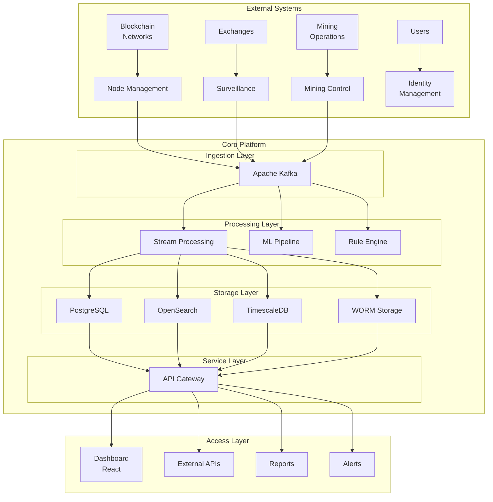
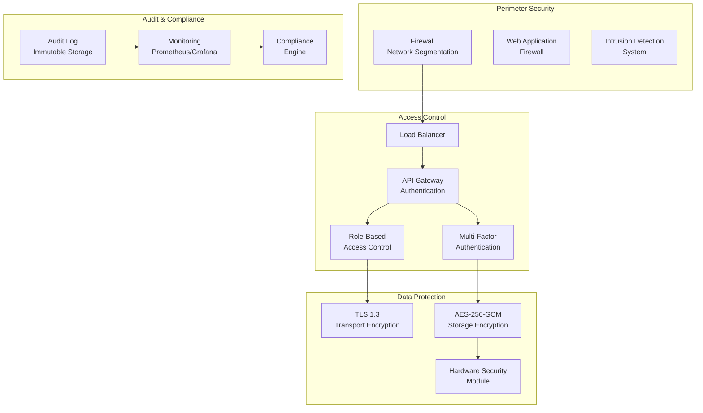

# System Overview

This document provides a comprehensive overview of the CSIC Platform architecture, core services, and operational capabilities.

## Platform Architecture

## Core Design Principles

The CSIC Platform follows several foundational design principles that distinguish it from conventional cryptocurrency monitoring solutions:

**Data Sovereignty**
All data remains within national borders with no reliance on foreign cloud services or international data processors. This architectural decision reflects the platform's primary target market: government agencies and regulatory bodies that cannot risk storing sensitive financial data on foreign-controlled infrastructure.

**Deterministic Compliance**
Regulatory rules are encoded in executable code rather than documented in natural language. This approach eliminates ambiguity in compliance interpretation and ensures consistent application of regulations across all monitored entities. When a mining operation exceeds its energy allocation or an exchange engages in market manipulation, the system responds according to predetermined rules rather than subjective judgment.

**Immutable Auditability**
All actions, transactions, and decisions are recorded in tamper-proof logs that support forensic investigation and legal proceedings. The audit infrastructure uses hash-chained logging to detect any attempt to modify historical records, providing the non-repudiation capabilities required for regulatory enforcement actions.

**Extensibility Through Modularity**
The core services for data ingestion, behavioral analytics, anomaly detection, risk scoring, and automated response form a foundation that can be adapted to diverse regulatory domains. This extensibility enables governments to leverage their investment in CSIC infrastructure across multiple use cases beyond cryptocurrency.

## Service Architecture

```mermaid
flowchart TB
    subgraph "Blockchain Services"
        BI[Blockchain Indexer]
        BN[Blockchain Node Manager]
    end
    
    subgraph "Compliance Services"
        CM[Compliance Module]
        RG[Regulatory Engine]
    end
    
    subgraph "Surveillance Services"
        ES[Exchange Surveillance]
        MS[Market Analysis]
    end
    
    subgraph "Control Services"
        CL[Control Layer]
        HM[Health Monitor]
        AL[Alert Service]
    end
    
    subgraph "Operational Services"
        MC[Mining Control]
        RP[Reporting]
        WG[Wallet Governance]
    end
    
    subgraph "Infrastructure Services"
        GW[API Gateway]
        ALGS[Audit Log Service]
        IDM[Identity Management]
    end
    
    GW --> BI
    GW --> CM
    GW --> ES
    GW --> MC
    GW --> CL
    GW --> HM
    GW --> RP
    GW --> WG
    GW --> ALGS
    GW --> IDM
```

## Complete Services Inventory

### Blockchain Services

#### Blockchain Indexer Service

The Blockchain Indexer Service is a high-performance microservice for indexing and querying blockchain data. This service continuously monitors blockchain networks, extracts relevant transaction and state data, and makes it readily available through a performant API. The indexer maintains real-time visibility into blockchain activities, supporting compliance operations and enabling sophisticated analytics and reporting capabilities.

The service handles high-throughput blockchain data ingestion while maintaining low-latency query responses. It supports multiple blockchain networks simultaneously, allowing organizations to monitor diverse ecosystems from a single deployment. Smart contract event indexing provides deep visibility into decentralized applications and token activities, parsing arbitrary contract ABIs and extracting specific events while filtering noise to focus on relevant data.

#### Blockchain Node Manager

The Blockchain Node Manager provides comprehensive management and monitoring capabilities for blockchain nodes across multiple networks. This service maintains connectivity with nodes operating on Ethereum, Polygon, BNB Smart Chain, Arbitrum, and other supported networks, enabling regulatory authorities to monitor node health, performance, and connectivity in real-time.

The node manager performs continuous health checks on configured blockchain nodes, tracking metrics such as block synchronization status, peer count, latency, and error rates. When node issues are detected, the service can automatically trigger alerts or remediation actions.

### Compliance Services

#### Compliance Module

The Compliance Module implements the core regulatory rule evaluation engine for the platform. This service evaluates transactions and addresses against configured compliance rules, generating alerts and enforcement actions when violations are detected. The module supports complex rule configurations including transaction value thresholds, velocity limits, geographic restrictions, and watchlist matching.

The service maintains a comprehensive rule engine where compliance officers can define, test, and deploy regulatory rules without code changes. Rules are evaluated in real-time as transactions flow through the system, with results stored for audit and reporting purposes.

### Surveillance Services

#### Exchange Surveillance Service

The Exchange Surveillance Service monitors cryptocurrency exchange activities to detect market abuse, ensure fair trading practices, and maintain market integrity. The service ingests real-time trade and order book data through Kafka event streaming, applying rule-based detection algorithms to identify suspicious patterns such as wash trading, spoofing, and pump-and-dump schemes.

Market analysts can configure detection thresholds and alert parameters through the service's management interface, adapting the surveillance system to evolving market conditions and emerging manipulation techniques.

### Control Services

#### Control Layer

The Control Layer implements the policy enforcement engine that translates regulatory rules into actionable system responses. This service coordinates actions across multiple platform components to enforce complex compliance policies that span service boundaries. The control layer maintains the authoritative state of regulatory configurations and ensures that all services apply consistent rules.

The service implements a decision engine that evaluates conditions across the platform and triggers appropriate responses. When compliance violations are detected, the control layer can automatically initiate enforcement actions including transaction blocking, account suspension, or alert generation.

**Core Capabilities:**
- **Policy Engine**: Evaluates regulatory policies against real-time system state, supporting complex conditions involving multiple metrics and thresholds
- **Enforcement Handler**: Executes enforcement actions including alerts, interventions, and automated remediation workflows
- **State Registry**: Maintains real-time visibility into system state with Redis-backed caching for high-performance access
- **Intervention Service**: Manages automated and manual interventions with escalation workflows and resolution tracking

**API Endpoints:**

| Method | Endpoint | Description |
|--------|----------|-------------|
| GET | `/api/v1/policies` | List all policies |
| POST | `/api/v1/policies` | Create a new policy |
| GET | `/api/v1/policies/:id` | Get policy by ID |
| PUT | `/api/v1/policies/:id` | Update a policy |
| DELETE | `/api/v1/policies/:id` | Delete a policy |
| POST | `/api/v1/evaluate` | Evaluate policies against provided data |
| GET | `/api/v1/enforcements` | List enforcement actions |
| POST | `/api/v1/interventions` | Create an intervention |
| PUT | `/api/v1/interventions/:id/status` | Update intervention status |

#### Health Monitor

The Health Monitor ensures platform reliability through continuous system status tracking and alerting. This service performs health checks on all platform components, aggregating status information into a comprehensive system health dashboard. When component failures or degradation are detected, the health monitor triggers alerts to operations teams and can initiate automated remediation workflows.

The service monitors both liveness indicators (is the service running) and readiness indicators (is the service able to process requests). Health checks include database connectivity, Kafka availability, memory utilization, and custom service-specific checks.

**API Endpoints:**

| Method | Endpoint | Description |
|--------|----------|-------------|
| GET | `/api/v1/services` | List all service statuses |
| GET | `/api/v1/services/:name` | Get service status by name |
| GET | `/api/v1/health` | Get system health summary |
| GET | `/api/v1/alert-rules` | List alert rules |
| POST | `/api/v1/alert-rules` | Create an alert rule |
| GET | `/api/v1/alerts` | List alerts |
| POST | `/api/v1/heartbeat` | Submit a service heartbeat |

### Operational Services

#### Mining Control Service

The Mining Control Service provides comprehensive monitoring and regulatory oversight of cryptocurrency mining operations. This service maintains a national registry of all licensed mining operations, tracking machine specifications, energy consumption patterns, and hash rate output. Regulatory authorities can monitor mining activity in real-time, enforce energy consumption limits, and respond to violations through automated or manual intervention mechanisms.

The service integrates with TimescaleDB for time-series storage of energy telemetry, enabling efficient querying of historical consumption patterns and trend analysis. The enforcement subsystem provides capabilities to suspend or throttle mining operations remotely, ensuring that regulatory responses can be implemented immediately when violations are detected.

#### Regulatory Reports Service

The Regulatory Reports Service generates comprehensive compliance reports for regulatory filing and internal oversight. This service supports multiple regulatory frameworks including FATF, MiCA, BSA, and GDPR requirements, producing reports in PDF, Excel, CSV, and JSON formats.

The report engine extracts data from multiple platform services to create comprehensive reports covering transaction monitoring results, compliance violations, enforcement actions, and system activity.

### Infrastructure Services

#### API Gateway

The API Gateway serves as the central entry point for all external requests to the platform. This service handles authentication, rate limiting, request routing, and protocol translation for all client interactions. The gateway provides a unified API surface for the entire platform, abstracting the internal microservice architecture from external consumers while enforcing security policies at the perimeter.

The gateway implements JWT-based authentication for user access and API key authentication for service-to-service communication. Request rate limiting protects backend services from overload scenarios, while request validation ensures that malformed requests are rejected before reaching internal services.

#### Audit Log Service

The Audit Log Service maintains immutable records of all system actions, supporting compliance reporting and forensic investigation. This service receives audit events from all platform components through Kafka event streaming, storing records in tamper-evident storage with cryptographic integrity protection.

The audit infrastructure uses hash-chained logging to detect any attempt to modify historical records, providing the non-repudiation capabilities required for regulatory enforcement actions. Each audit record includes the actor identity, timestamp, action performed, resource affected, and outcome of the action.

## Security Architecture

### Access Control Features

- **Role-Based Access Control (RBAC)**: Granular permissions system controlling access to platform functionality
- **Multi-Factor Authentication (MFA)**: Additional verification layer for sensitive operations
- **Dual-Control Mechanism**: Two-person approval requirement for critical actions
- **Session Management**: Configurable session timeouts and concurrent session limits

### Data Protection Features

- **Transport Encryption**: TLS 1.3 for all network communications
- **Storage Encryption**: AES-256-GCM encryption for data at rest
- **Key Management**: Hardware Security Module (HSM) integration
- **WORM Storage**: Write-Once-Read-Many storage for audit logs

## Compliance Standards

The platform implements controls aligned with international standards:

| Standard | Focus Area | Implementation |
|----------|------------|----------------|
| ISO 27001 | Information Security | Comprehensive security controls |
| GDPR | Data Protection | Privacy by design, data subject rights |
| Basel III | Financial Regulation | Risk management, capital requirements |
| FATF | Anti-Money Laundering | Transaction monitoring, reporting |

## System Requirements

### Hardware Requirements

| Component | Minimum | Recommended | High Availability |
|-----------|---------|-------------|-------------------|
| CPU | 8 cores | 32 cores | 64 cores |
| Memory | 32 GB | 128 GB | 256 GB |
| Storage | 500 GB SSD | 2 TB NVMe | 4 TB NVMe RAID |
| Network | 1 Gbps | 10 Gbps | Redundant 10 Gbps |

### Software Requirements

- **Operating System**: CentOS 8 / Rocky Linux 8 / Ubuntu 22.04 LTS
- **Container Runtime**: Docker 24+ / containerd
- **Orchestration**: Kubernetes 1.28+ / K3s
- **Monitoring**: Prometheus + Grafana

## Deployment Options

### Local Development

Docker Compose-based deployment for development and testing environments.

### On-Premise Deployment

Complete offline deployment with all data remaining within organizational boundaries. Suitable for air-gapped environments with enhanced security requirements.

### Private Cloud Deployment

Kubernetes-based deployment providing container orchestration, automatic scaling, and self-healing capabilities. Supports multi-tenant deployments with namespace isolation.

### Hybrid Mode

Core compliance components deployed on-premise with cloud-assisted analytics capabilities. Suitable for organizations requiring local data residency with scalable processing power.

## Applications Beyond Cryptocurrency

The CSIC Platform's core capabilities extend to multiple domains requiring sophisticated digital oversight and control infrastructure:

### Central Bank Digital Currency (CBDC) Monitoring

The platform provides infrastructure for monitoring CBDC transactions, detecting fraud, and ensuring monetary policy effectiveness. The existing transaction monitoring modules adapt to CBDC-specific transaction attributes with tiered privacy level support.

### Financial Crime Compliance

Anti-money laundering capabilities built for cryptocurrency naturally extend to traditional banking. The platform's hybrid approach combining explainable rule engines with adaptive machine learning models addresses FATF requirements across all financial institutions.

### National Identity Systems

Behavioral analytics capabilities translate to identity management, analyzing authentication patterns and detecting identity fraud. Privacy-preserving analytics including federated learning and differential privacy protect individual privacy while enabling cross-system pattern detection.

### Smart City Control Systems

The platform provides unified visibility across city domains including transportation, energy, environment, and public safety. Automated response capabilities enable active management of city infrastructure based on real-time sensor data.

## Version History

| Version | Date | Changes |
|---------|------|---------|
| 1.0.0 | 2024-01-15 | Initial platform release |
| 1.1.0 | 2024-03-01 | Blockchain analysis module added |
| 1.2.0 | 2024-06-01 | Mining control module added |
| 2.0.0 | 2024-12-01 | Major architecture upgrade |

## Maintenance and Support

### Monitoring Metrics

- System health status across all components
- Service availability and response times
- Performance metrics and resource utilization
- Security events and anomaly detection

### Backup Strategy

- **Full Backups**: Daily automated backups
- **Incremental Backups**: Hourly snapshots
- **Off-site Replication**: Real-time synchronization
- **Retention**: 7 years meeting compliance requirements

### Disaster Recovery

- **Recovery Point Objective (RPO)**: 1 hour
- **Recovery Time Objective (RTO)**: 4 hours
- **Failover**: Manual and automatic options
- **Testing**: Quarterly disaster recovery exercises
